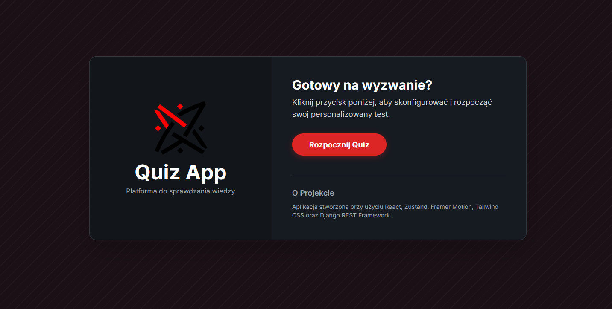

# Quiz App



Aplikacja internetowa typu "full-stack" do przeprowadzania quizów i testów. Użytkownicy mogą wybrać test z dostępnej listy, rozwiązać go w określonym czasie, a po zakończeniu zobaczyć swoje wyniki i przejrzeć odpowiedzi.

---

## 📋 Spis treści

- [✨ Funkcjonalności](#-funkcjonalności)
- [🛠️ Stos technologiczny](#️-stos-technologiczny)
- [🚀 Uruchomienie projektu](#-uruchomienie-projektu)
  - [Wymagania wstępne](#wymagania-wstępne)
  - [Konfiguracja Backendu (Django)](#konfiguracja-backendu-django)
  - [Konfiguracja Frontendu (React)](#konfiguracja-frontendu-react)
- [📂 Struktura projektu](#-struktura-projektu)
- [📝 Plany rozwoju](#-plany-rozwoju)

---

## ✨ Funkcjonalności

- **Wybór testu:** Użytkownik może wybrać jeden z wielu dostępnych testów z różnych kategorii.
- **Limit czasowy:** Każdy quiz ma zdefiniowany limit czasu na jego ukończenie.
- **Pasek postępu:** Wizualna reprezentacja postępu w rozwiązywaniu testu.
- **Podsumowanie wyników:** Po zakończeniu testu wyświetlana jest strona z wynikiem.
- **Przegląd odpowiedzi:** Możliwość przejrzenia swoich odpowiedzi i porównania ich z poprawnymi.
- **Tryb Ciemny/Jasny:** Przełącznik motywu dla komfortu użytkowania.
- **Responsywność:** Aplikacja jest w pełni responsywna i działa na urządzeniach mobilnych i desktopowych.

---

## 🛠️ Stos technologiczny

### Frontend

- **React.js:** Biblioteka do budowy interfejsu użytkownika.
- **Vite:** Narzędzie do szybkiego budowania i serwowania aplikacji frontendowych.
- **Zustand:** Proste i wydajne zarządzanie stanem aplikacji.
- **Tailwind CSS:** Framework CSS do szybkiego stylowania.
- **Axios:** Klient HTTP do komunikacji z API.
- **Framer Motion:** Biblioteka do zaawansowanych animacji.
- **React Router:** Do obsługi routingu po stronie klienta.

### Backend

- **Django:** Framework webowy Pythona do szybkiego tworzenia bezpiecznych i skalowalnych aplikacji.
- **Django REST Framework:** Potężny zestaw narzędzi do budowy API webowych.
- **Python:** Język programowania używany po stronie serwera.

---

## 🚀 Uruchomienie projektu

Aby uruchomić projekt lokalnie, postępuj zgodnie z poniższymi instrukcjami.

### Wymagania wstępne

- **Python** (wersja 3.8 lub nowsza)
- **Node.js** i **npm** (lub yarn)

### Konfiguracja Backendu (Django)

1.  **Sklonuj repozytorium:**
    ```bash
    git clone [https://github.com/Zyrandool/Quiz-App](https://github.com/Zyrandool/Quiz-App)
    cd quiz-app
    ```

2.  **Utwórz i aktywuj wirtualne środowisko:**
    ```bash
    # Dla Windows
    python -m venv env
    .\env\Scripts\activate
    ```

3.  **Zainstaluj zależności Pythona:**
    ```bash
    pip install -r requirements.txt
    ```

4.  **Uruchom serwer deweloperski Django:**
    ```bash
    python manage.py runserver
    ```
    Backend będzie dostępny pod adresem `http://127.0.0.1:8000`.

### Konfiguracja Frontendu (React)

1.  **Przejdź do katalogu frontendu** (w nowym oknie terminala):
    ```bash
    cd frontend
    ```

2.  **Zainstaluj zależności Node.js:**
    ```bash
    npm install
    ```

3.  **Uruchom serwer deweloperski Vite:**
    ```bash
    npm run dev
    ```
    Frontend będzie dostępny pod adresem `http://localhost:5173` i automatycznie połączy się z backendem.

---

## 📂 Struktura projektu

Projekt jest podzielony na dwie główne części: `frontend` i resztę katalogów tworzących backend.

```
.
├── api_v1/           # Aplikacja Django z logiką API
├── backend_project/  # Główny folder konfiguracyjny Django
├── frontend/         # Kod źródłowy aplikacji React
│   ├── src/
│   │   ├── components/ # Komponenty wielokrotnego użytku
│   │   ├── pages/      # Komponenty reprezentujące strony
│   │   ├── services/   # Logika komunikacji z API
│   │   └── store/      # Zarządzanie stanem (Zustand)
│   └── ...
├── media/            # Pliki statyczne, w tym pliki JSON z testami
├── .gitignore
├── build.sh          # Skrypt do budowania aplikacji na produkcję
├── manage.py         # Narzędzie linii komend Django
├── requirements.txt  # Zależności backendu
└── README.md         # Ten plik
```

---

## 📝 Plany rozwoju

### Planowane rozszerzenia (najbliższe priorytety)

- [ ] **Naprawa licznika** - Licznik powinien albo zatrzymywać się gdy user sprawdza odpowiedź albo powinien uniemożliwiać sprawdzanie odpowiedzi w trakcie testu
- [ ] **Zgłaszanie pytań/odpowiedzi** Umożliwienie użytkownikowi zgłoszenia błędu w pytaniu/odpowiedzi lub w ocenie AI
- [ ] **Asynchroniczne ocenianie (Celery & Redis):** Wprowadzenie zadań w tle do oceny otwartych pytań przez AI, aby użytkownik nie musiał czekać na wynik i mógł kontynuować test.
- [ ] **Migracja danych:** Przeniesienie treści quizów z plików JSON do relacyjnej bazy danych w celu zwiększenia wydajności i skalowalności.

### Możliwe rozszerzenia (pomysły na przyszłość)

- [ ] **System uwierzytelniania:** Dodanie logowania i rejestracji użytkowników.
- [ ] **Historia wyników:** Zapisywanie wyników testów dla zalogowanych użytkowników.
- [ ] **Panel administratora:** Możliwość dodawania, edytowania i usuwania quizów z poziomu interfejsu graficznego.
- [ ] **Rozbudowane statystyki:** Wykresy i bardziej szczegółowe analizy wyników.
- [ ] **Kategorie pytań:** Możliwość filtrowania i grupowania pytań według kategorii.
- [ ] **Tryb wieloosobowy:** Możliwość rywalizacji ze znajomymi w czasie rzeczywistym.

### Ukończone

- [x] **Formatowanie tekstu pytań i wyjaśnień:** Zaimplementowano obsługę formatowania Markdown dla treści pytań i wyjaśnień przy użyciu biblioteki `react-markdown`. Dodano wsparcie dla wieloliniowych tekstów oraz kolorowanych bloków kodu (` ``` `) dzięki integracji z `react-syntax-highlighter`.
- [x] **Lepsza obsługa błędów:** Wprowadzono kompleksową obsługę błędów na wszystkich poziomach aplikacji. Backend zwraca ustrukturyzowane odpowiedzi JSON i wykorzystuje standardowe logowanie. Frontend globalnie przechwytuje błędy API za pomocą interceptora i jest chroniony przez komponent `ErrorBoundary` łapiący błędy renderowania.
