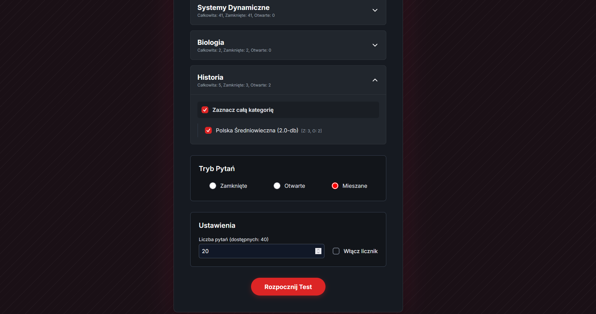
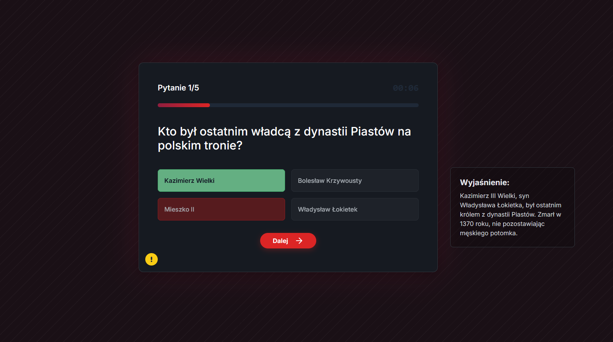
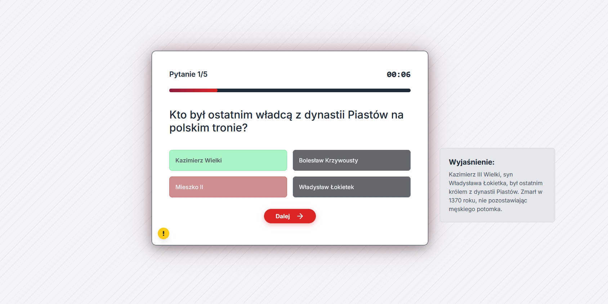
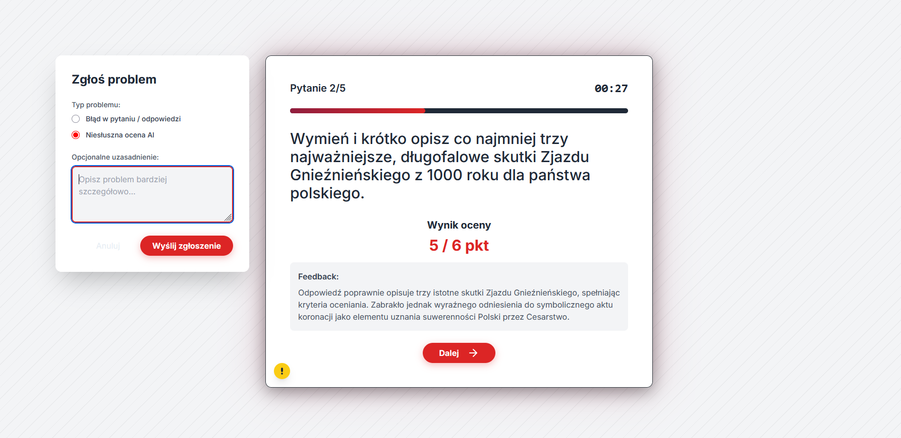
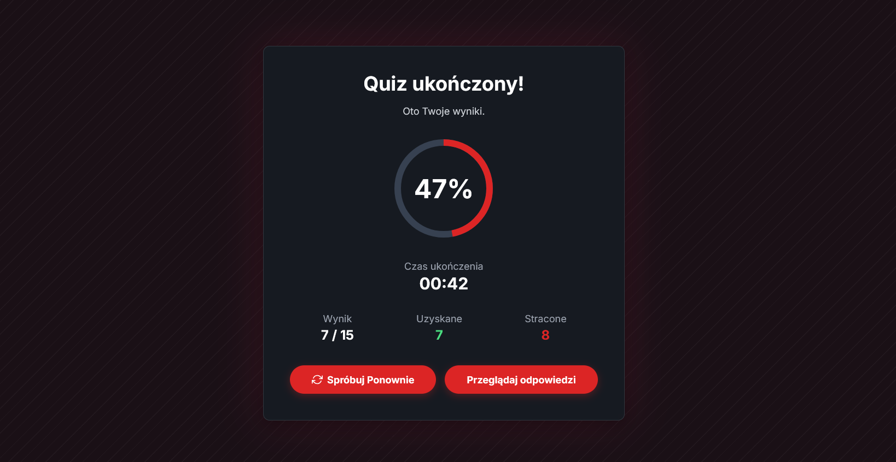
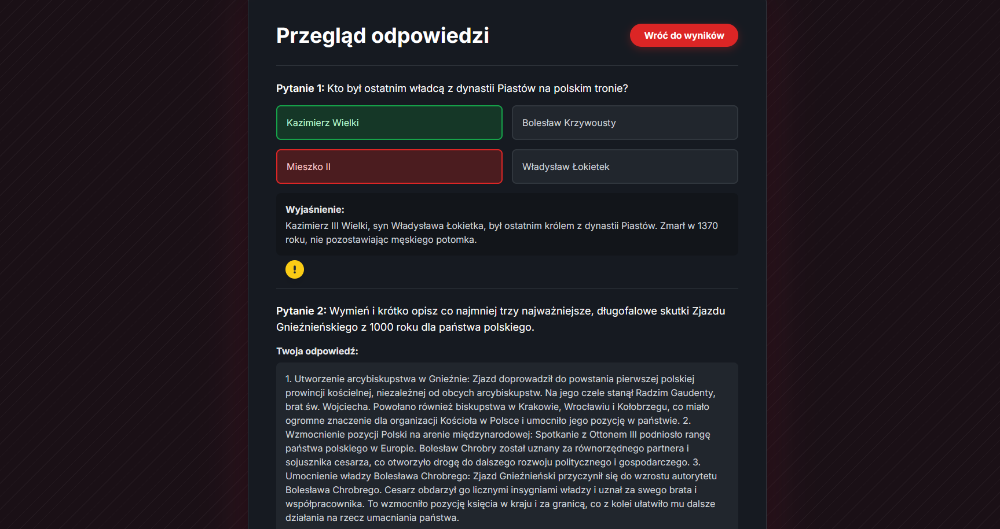

> **Note:** This is the English version of the documentation. For the Polish version, please click the link below.
>
> ➡️ **[Przeczytaj dokumentację w języku polskim](./docs/PL_README.md)**
>
> ---

# Quiz App


This is an advanced full-stack application for conducting interactive quizzes and tests. It has been designed with a dynamic and engaging user experience in mind. The application not only allows solving tests with a time limit but also offers immediate feedback, including AI-powered evaluation of open-ended questions. After completing a quiz, the user receives a detailed summary of the results and has the opportunity to review their answers for learning and analysis.

---

## 📋 Table of Contents

- [🖼️ Gallery](#️-gallery)
- [✨ Features](#-features)
- [🛠️ Tech Stack](#️-tech-stack)
- [🚀 Project Setup](#-project-setup)
- [🤖 AI Configuration](#-ai-configuration)
- [📂 Project Structure](#-project-structure)
- [✍️ Content Creation](#️-content-creation)
- [📝 Development Plans](#-development-plans)

---

## 🖼️ Gallery

| Test Configuration | Question and Explanation (Dark Mode) | Question and Explanation (Light Mode) |
| :---: |:---:|:---:|
|  |  |  |
| *The user selects the category, number of questions, and time limit.* | *View of a question with the selected answer and a detailed explanation.* | *The same view, but in a comfortable light mode.* |

| AI Evaluation and Error Reporting | Results Screen | Answer Review |
| :---: |:---:|:---:|
|  |  |  |
| *An open-ended question evaluated by AI and a modal for reporting issues.* | *A clear summary of the test results with a percentage score.* | *The ability to review all questions and answers after the test.* |

## ✨ Features

- **Test Selection:** Users can choose from many available tests in various categories.
- **Time Limit:** Each quiz has a defined time limit that pauses after an answer is given and resumes with the next question.
- **Asynchronous Grading (AI):** Open-ended questions are graded in the background by AI, allowing the user to continue the test without waiting for the result.
- **Error Reporting:** Users can report errors in questions, answers, or AI evaluations.
- **Markdown Formatting:** Questions and explanations support text formatting (bold, italics, lists, etc.) for better readability.
- **Progress Bar:** A visual representation of the test-taking progress.
- **Results Summary:** A results page is displayed after completing the test.
- **Answer Review:** The ability to review your answers and compare them with the correct ones.
- **Dark/Light Mode:** A theme switcher for user comfort.
- **Responsiveness:** The application is fully responsive and works on mobile and desktop devices.
- **Admin Panel:** An extensive panel for managing quizzes, questions, and categories directly in the Django admin interface.

---

## 🛠️ Tech Stack

### Frontend

- **React.js:** A library for building user interfaces.
- **Vite:** A tool for fast frontend building and serving.
- **Zustand:** Simple and efficient state management for applications.
- **Tailwind CSS:** A CSS framework for rapid styling.
- **Axios:** An HTTP client for communicating with the API.
- **Framer Motion:** A library for advanced animations.
- **React Router:** For client-side routing.
- **React Markdown:** For rendering content in Markdown format.

### Backend

- **Django:** A Python web framework for rapid development of secure and scalable applications.
- **Django REST Framework:** A powerful toolkit for building web APIs.
- **Celery:** A system for managing asynchronous background tasks.
- **Python:** The programming language used on the server side.
- **PostgreSQL:** A production-ready, relational database.
- **Redis:** An in-memory database used as a broker for Celery.

### Infrastructure and Tools

- **Docker & Docker Compose:** For containerization and service orchestration.
- **Nginx:** A proxy server for handling traffic and serving static files.
- **Gunicorn:** A WSGI application server for Django.

---

## 🚀 Project Setup

Detailed instructions for configuring and running the project—both in a production environment using Docker and locally on a development machine—have been moved to a separate document.

➡️ **[Read the Installation Guide](./docs/EN_INSTALL.md)**

---

## 🤖 AI Configuration

The application uses a default prompt for the AI model that evaluates open-ended questions. You can modify this prompt to better suit your needs directly from the Django admin panel.

1.  **Log in to the admin panel:** Go to the `/admin` address of your application and log in with your superuser account.
2.  **Navigate to Prompt Configurations:** In the `API_V1` section, find and click on "Prompt configurations".
3.  **Edit the default prompt:** You will see a default prompt named `default_prompt`. Click on it to open the edit view.
4.  **Modify the prompt:** In the "System prompt" field, you can change the content of the prompt. The prompt uses placeholders like `{grading_criteria}` and `{user_answer}` which are dynamically replaced with the question's criteria and the user's answer during evaluation. Make sure to keep these placeholders if you want the AI to use this data.
5.  **Save the changes:** Click the "Save" button. The new prompt will be used for all subsequent AI evaluations.

---

## 📂 Project Structure

The project is divided into two main parts: `frontend` and the rest of the directories that make up the backend.

```
.
├── api_v1/           # Django application with API logic, models, and views
├── backend_project/  # Main Django project configuration folder
├── certs/            # SSL certificates for Nginx/PostgreSQL
├── docs/             # Project documentation
├── frontend/         # React application source code (Vite)
├── media/            # Media files uploaded by users
├── nginx/            # Nginx server configuration
├── postgres/         # PostgreSQL database configuration
├── .gitignore
├── build.sh          # Script for building Docker images for production
├── docker-compose.yml # Definition of services and Docker container orchestration
├── Dockerfile        # Instructions for building the Docker image for the Django application
├── Dockerfile.celery # Instructions for building the Docker image for the Celery worker
├── manage.py         # Django command-line tool
├── Readme.md         # This file
├── requirements.txt  # Backend dependencies (Python)
└── start_dev.bat     # Script for running the development environment (Windows)
```

---

## ✍️ Content Creation

Want to add your own questions or entire tests to the application? We have prepared a detailed guide that explains step-by-step how to create JSON files with quizzes and import them into the database.

➡️ **[Read the Guide on Creating and Importing Quizzes](./docs/EN_QUESTIONS.md)**

---

## 📝 Development Plans

### Possible Extensions (Future Ideas)

- [ ] **Authentication System:** Add user login and registration.
- [ ] **Results History:** Save test results for logged-in users.
- [ ] **Advanced Statistics:** Charts and more detailed analysis of results.

### Completed

- [x] **Reporting Questions/Answers:** Allows the user to report an error in a question/answer or in the AI evaluation.
- [x] **Asynchronous Grading (Celery & Redis):** Introduced background tasks for AI evaluation of open-ended questions, so the user does not have to wait for the result and can continue the test.
- [x] **Admin Panel:** Expanded the admin panel to allow for convenient creation and editing of quizzes from the graphical interface.
- [x] **Data Migration:** Migrated quiz content from JSON files to a relational database (PostgreSQL) to increase performance and scalability.
- [x] **Timer Fix:** The timer now stops after the user confirms an answer and resumes on the next question.
- [x] **Text Formatting for Questions and Explanations:** Implemented Markdown support for question and explanation content using the `react-markdown` library.
- [x] **Improved Error Handling:** Introduced comprehensive error handling at all levels of the application.
